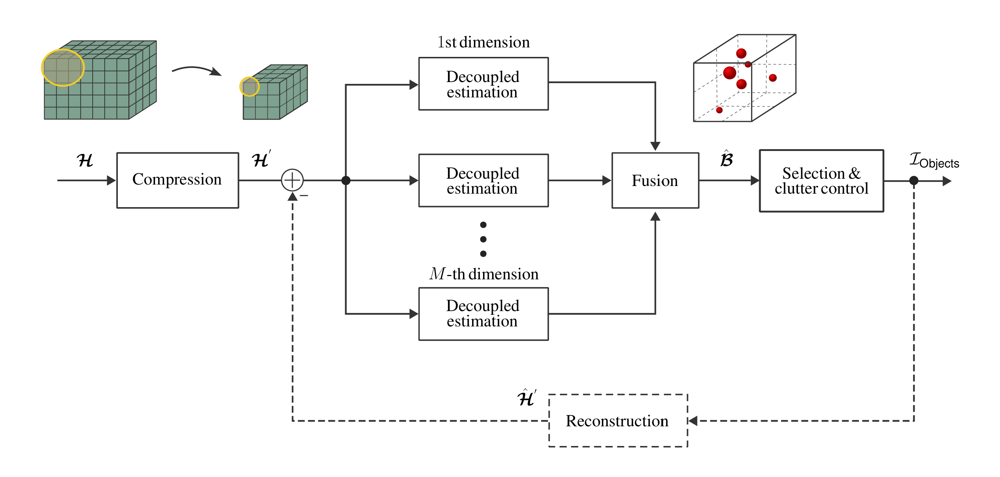

# PLAIN Estimation Architecture


This repository contains the code for the com**p**ressed decoup**l**ed estim**a**tion and **i**nput-based fusio**n** (PLAIN) architecture, aiming for scalable and flexible parameter estimation in the context of integrated sensing and communication (ISAC). 

The work is currently available as a preprint here: [PLAIN: Scalable Estimation Architecture for Integrated Sensing and Communication](https://arxiv.org/abs/2503.21242).

#### Abstract
> Integrated sensing and communication (ISAC) is envisioned be to one of the paradigms upon which sixth-generation (6G) mobile networks will be built, extending localization and tracking capabilities, as well as giving birth to environment-aware wireless access. A key aspect of sensing integration is parameter estimation, which involves extracting information about the surrounding environment, such as the direction, distance, velocity, and orientation of various objects within. This is typically of a high-dimensional nature, which can lead to significant computational complexity, if performed jointly across multiple sensing dimensions, such as space, frequency, and time. Additionally, due to the incorporation of sensing on top of the data transmission, the time window available for sensing is likely to be very short, resulting in an estimation problem where only a single snapshot is accessible. In this article, we propose PLAIN, a tensor-based parameter estimation architecture that flexibly scales with multiple sensing dimensions and can handle high dimensionality, limited measurement time, and super-resolution requirements. It consists of three stages: a compression stage, where the high dimensional input is converted into lower dimensionality, without sacrificing resolution; a decoupled estimation stage, where the parameters across the different dimensions are estimated in parallel with low complexity; an input-based fusion stage, where the decoupled parameters are fused together to form a paired multidimensional estimate. We investigate the performance of the architecture for different configurations and compare its performance against practical sequential and joint estimation baselines, as well as theoretical bounds. Our results show that PLAIN, using tools from tensor algebra, subspace-based processing, and compressed sensing, can scale flexibly with dimensionality, while operating with low complexity and maintaining super-resolution capabilities.

## Getting Started
Get started by running the ```main.m``` file. This executes an OFDM-based example scenario demonstrating the usage of the ```PLAIN``` class for angle-delay-Doppler estimation.

## Citation
If you use PLAIN in your work, please cite it (current preprint) as
```
B. Tahir, P. Svoboda, and M. Rupp, “PLAIN: Scalable Estimation Architecture for Integrated Sensing and Communication,” arXiv:2503.21242, 2025. [Online]. Available: https://arxiv.org/abs/2503.21242.
```
BibTeX
```
@misc{PLAIN_2025,
      title={{PLAIN: Scalable Estimation Architecture for Integrated Sensing and Communication}}, 
      author={Bashar Tahir and Philipp Svoboda and Markus Rupp},
      year={2025},
      howpublished={arXiv:2503.21242},
      eprint={2503.21242},
      archivePrefix={arXiv},
      primaryClass={eess.SP},
      url={https://arxiv.org/abs/2503.21242}, 
}
```
## Association and Acknowledgements
At the time of submitting this code, Bashar Tahir and Philipp Svoboda are with Christian Doppler Laboratory for Digital Twin assisted AI for sustainable Radio Access Networks, Institute of Telecommunications, TU Wien, Austria. Markus Rupp is with the Institute of Telecommunications, TU Wien, Austria. 

The financial support by the Austrian Federal Ministry for Labour and Economy and the National Foundation for Research, Technology and Development, and the Christian Doppler Research Association is gratefully acknowledged.
